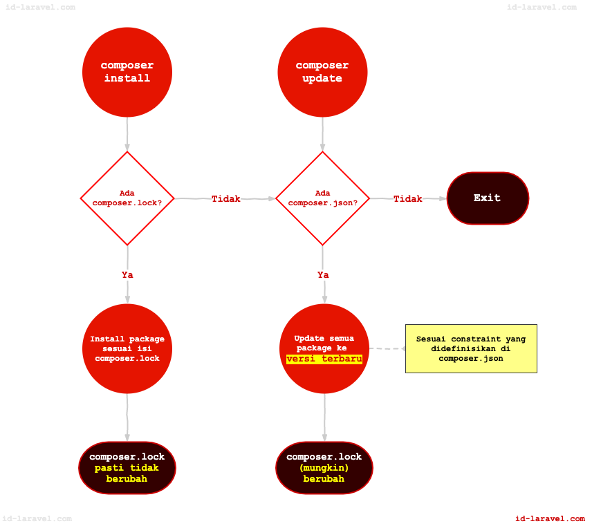

## Intro

Hari ini, hampir mustahil membuat software sistem informasi tanpa bantuan *package manager*. Demikian juga PHP dengan [composer](https://getcomposer.org/)-nya. Sehari hari kita terbiasa memanfaatkan Composer untuk mengunduh package yang kita butuhkan. Ingin melakukan operasi terhadap tanggal? Ada [nesbot/carbon](https://packagist.org/packages/nesbot/carbon). Perlu integrasi dengan AWS? Ada [aws/aws-sdk-php](https://packagist.org/packages/aws/aws-sdk-php). Butuh data wilayah se-Indonesia? Ada [laravolt/indonesia](https://packagist.org/packages/laravolt/indonesia).

Salah satu perintah Composer yang sering kita jalankan adalah `composer install` dan `composer update`. Banyak programmer yang kurang begitu memerhatikan perbedaan kedua perintah tersebut. Secara kasat mata mungkin terlihat sama, tetapi sesungguhnya ada perbedaan yang sangat mendasar, yang harus dipahami agar tidak menimbulkan "keributan" di kemudian hari.

## Perbedaan Composer Install dan Update

Membicarakan perbedaan `composer install` dan `composer update` harus dimulai dari memahami dua buah file yang sering kita jumpai dalam sebuah repo sebuah proyek berbasis PHP, yaitu `composer.json` dan `composer.lock`.

Secara singkat, **composer.json** adalah file yang **dibuat secara manual** untuk mendefinisikan package apa saja yang dibutuhkan beserta batasan (*constraint*) versinya. Sementara itu, **composer.lock** adalah file yang berisi daftar **semua package** beserta versinya, yang **digenerate** secara otomatis berdasar isi composer.json. Cobalah sesekali melihat isi file `composer.lock` agar lebih paham.

Diagram di bawah ini bisa menjadi gambaran awal untuk memahami perbedaan install dan update dan kaitannya dengan composer.json serta composer.lock.



Ketika repo (folder proyek) pertama kali dibuat, biasanya hanya ada file `composer.json`.  Sebagai contoh, silakan lihat repo [Laravel](https://github.com/laravel/laravel). Disitu terlihat Laravel hanya menyertakan file composer.json. Ketika memulai proyek *from scratch* dan tanpa framework, file ini bisa dibuat secara manual atau digenerate dengan perintah `composer init`. 

Setelah itu perintah `composer install` bisa dijalankan. Sesuai alur pada diagram di atas, maka Composer akan mengecek versi terbaru dari semua package (sesuai yg tertulis di composer.json), mengunduhnya, lalu meng-generate file `composer.lock`. 

Jika di composer.json tercantum `"laravel/framework": "^6.0"` sedangkan versi yang tersedia sudah sampai 6.4.0, maka yang akan diunduh dan dicatat di `composer.lock` adalah versi 6.4.0, bukan 6.0.0. Pembahasan tentang perbedaan cara penulisan versi bisa dibaca di [artikel berikut ini](https://madewithlove.be/tilde-and-caret-constraints/).

> Untuk Laravel, jika folder proyek pertama kali dibuat melalui perintah `composer create-project laravel/laravel aplikasiku` atau `laravel new aplikasiku`, maka perintah `composer install` secara otomatis akan langsung dijalankan sehingga seolah-olah file `composer.lock` sudah ada.

Lalu, semua source code termasuk **composer.json dan composer.lock** dicommit dan dipush ke SVN (misalnya gitlab, github, atau bitbucket). Programmer lain yang akan setup pertama kali, cukup melakukan *clone repository* dan menjalankan `composer install`. Tidak perlu (dan tidak direkomendasikan) menjalankan `composer update`.

## Kenapa composer.lock Harus Dicommit?

Masih ada beberapa (lead) programmer yang memasukkan composer.lock ke dalam .gitignore. Artinya, composer.lock tidak masuk ke repository sehingga setiap programmer harus meng-generatenya sendiri dengan perintah `composer install` ataupun `composer.update`. Ada dua kerugian ketika melakukan ini:

1. Tanpa composer.lock, menjalankan `composer install` ataupun `composer update` menjadi jauh lebih lama.
2. Jika setiap programmer memiliki versi `composer.lock` masing-masing, maka ada potensi perbedaan versi package yang diinstall. Hal ini bisa menjadi penyebab **jalan kok di tempat saya**. Sebagai contoh, berikut ini cerita pertengkaran Jon dan Dodo:
    - Hari Senin, Jon melakukan composer install, mendapatkan Laravel versi 6.1.0, composer.lock tidak dicommit.
    - Selasa pagi, Jon menemukan bug aneh, lalu minta bantuan temannya, Dodo.
    - Selasa sore, ada yang melaporkan bug yang sama di Laravel.
    - Rabu pagi, Laravel merilis versi baru 6.2.0 untuk memperbaiki bug tersebut.
    - Kamis, Dodo setup proyek di localhost dan menjalankan `composer install`. Nah, karena tidak ada file `composer.lock`, maka sesuai diagram di atas, Composer akan mengunduh versi terbaru yaitu versi 6.2.0 yang sudah mengakomodir bug yang ditemui Jon. Karena bug sudah diperbaiki di level framework, Dodo tidak bisa mereproduksi bug yang dilaporkan Jon. Tetapi, karena masih terinstall Laravel 6.1.0, Jon masih menemui bug tersebug di localhost-nya.
    - Sepanjang Kamis-Jumat, Jon dan Dodo bertengkar hebat karena **jalan kok di tempat saya, laptopmu yang error kali**. Semuanya disebabkan karena composer.lock tidak dicommit. Menyedihkan.

> Meng-ignore composer.lock sudah lama [tidak dianjurkan](https://getcomposer.org/doc/01-basic-usage.md#commit-your-composer-lock-file-to-version-control). Jika kamu masih menemui lead programmer yang memutuskan seperti itu, silakan diingatkan agar kembali ke jalan yang benar.

## Kapan Melakukan Update

Perintah `composer update` dijalankan hanya dan hanya **jika ada niatan yang dilakukan secara sadar untuk mengupdate sebagian atau semua package**. Setelah melakukan `composer update`, maka kemungkinan besar file `composer.lock` akan berubah. Programmer yang melakukan update tersebut berkewajiban untuk meng-commit `composer.lock` sehingga programmer lain tinggal menjalankan `composer install` untuk bisa mendapatkan versi package yang sama.

Pada prakteknya, lebih dianjurkan untuk melakukan update secara spesifik ke package tertentu, yang memang kita ketahui ada versi baru yang dirilis dan kita membutuhkan versi baru tersebut. Caranya dengan menjalankan `composer update <vendor/package-name>`.

Mengambil contoh kasus Jon & Dodo di atas, maka kita cukup menjalankan perintah:

```bash
composer update laravel/framework
```

Composer selanjutnya akan mengecek apakah laravel/framework sudah merilis versi baru. Jika ada, source code laravel/framework di folder `vendor` dan isi file composer.lock akan diperbarui. Package lain tidak akan tersentuh. 

## 

## Referensi

1. https://adamcod.es/2013/03/07/composer-install-vs-composer-update.html#fn1
2. https://getcomposer.org/