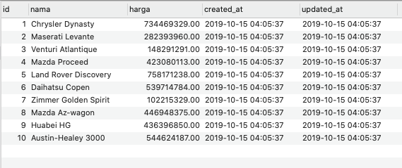
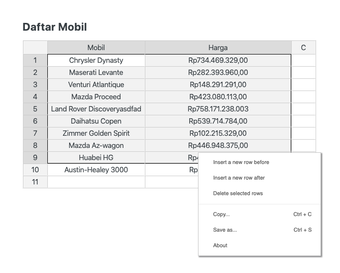
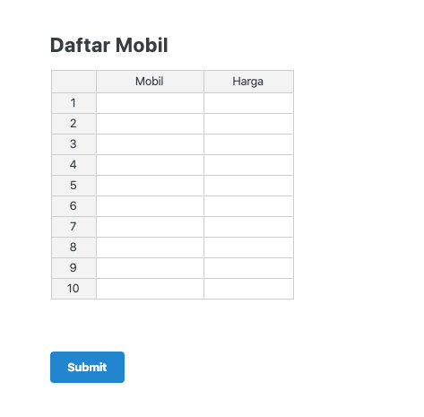
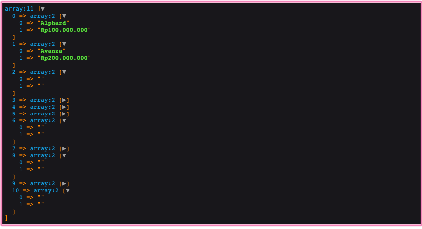
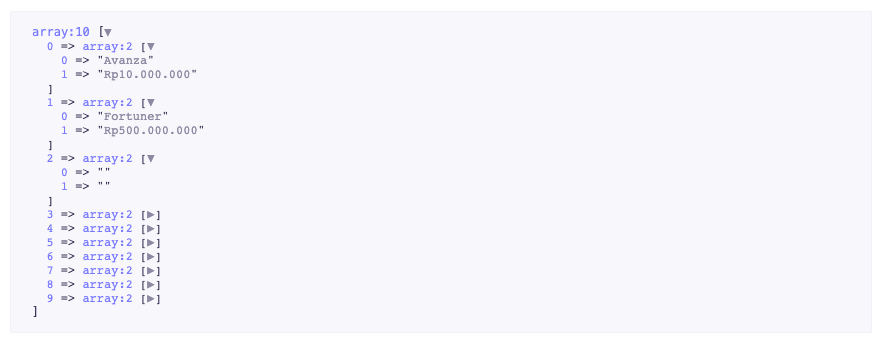
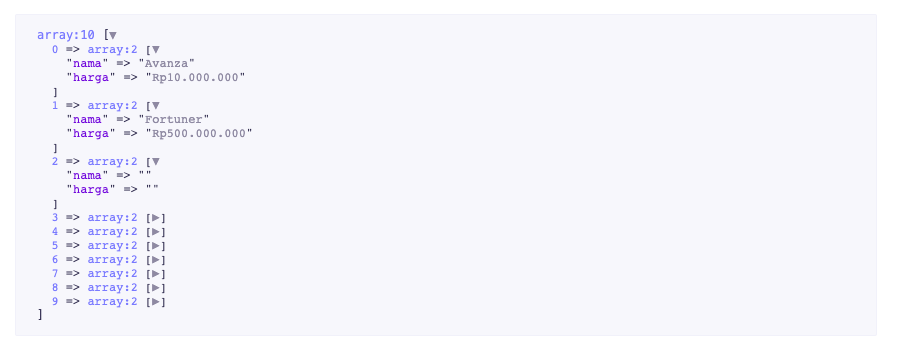
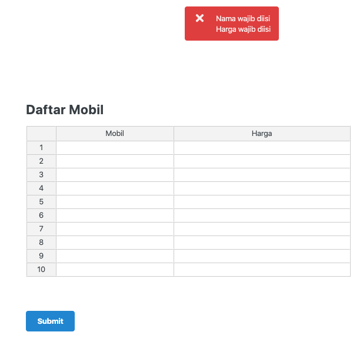

## Apa Itu jExcel?

jExcel adalah sebuah library Javascript untuk menampilkan data menyerupai *spreadsheet* atau *excel*. Ada kalanya mekanisme CRUD seperti di excel, dimana pengguna bisa langsung melakukan *editing* dan penambahan *row* dengan cepat, lebih disukai karena tidak ribet ketika melakukan banyak perubahan.

Tutorial kali ini akan membahas cara melakukan CRUD secara sederhana menggunakan jExcel, yang meliputi:

1. Menampilkan data
2. Input bulk data 
3. Validasi data
4. Edit data
5. Hapus data

Semua contoh kode akan menggunakan jExcel v3 dan jQuery.

## Persiapan

Kita akan membuat sebuah CRUD sederhana untuk melakukan input data mobil dengan atribut merk dan harga. Isi tabel mobil bisa dilihat di bawah ini:



Silakan buat migration dan seeder sendiri atau bisa mencoba hasil akhirnya di https://github.com/berbageek/jexcel-crud.

## Menampilkan Data

[jExcel](https://bossanova.uk/jexcel/v3/) adalah *library frontend*, jadi untuk mencobanya kita harus menyiapkan sebuah halaman index terlebih dahulu.

### Tambah Route

Buat sebuah route baru untuk menampilkan data:

```php
Route::get('mobil', 'MobilController@index')->name('mobil.index');
```

### Buat Controller

Buat Controller baru dengan perintah `php artisan make:controller MobilController`:

```php
<?php

namespace App\Http\Controllers;

use App\Mobil;

class MobilController extends Controller
{
    public function index()
    {
        // mempersiapkan data untuk jexcel
        $items = Mobil::all(['nama', 'harga']);

        return view('mobil.index', compact('items'));
    }
}
```

Yang patut diperhatikan adalah pemanggilan `Mobil::all(['nama', 'harga'])` dimana kita menyebutkan secara spesifik kolom yang diminta, sesuai apa yang akan ditampilkan di jExcel.

### View

Menampilkan jExcel di view cukup dilakukan dalam 4 langkah mudah:

1. Siapkan div kosong sebagai placeholder
2. Tambahkan aset-aset jExcel
3. Persiapkan data JSON
4. Definisikan kolom

```html
@extends('ui::layouts.centered')
@section('content')

    <h2 class="ui header">Daftar Mobil</h2>

    <!-- step 1: placeholder -->
    <div id="spreadsheet"></div>

@endsection

@push('script')

    // step 2: include aset-aset jExcel
    <script src="https://bossanova.uk/jexcel/v3/jexcel.js"></script>
    <link rel="stylesheet" href="https://bossanova.uk/jexcel/v3/jexcel.css" type="text/css"/>
    <script src="https://bossanova.uk/jsuites/v2/jsuites.js"></script>
    <link rel="stylesheet" href="https://bossanova.uk/jsuites/v2/jsuites.css" type="text/css"/>

    <script>


      // step 3: ubah data dari Controller menjadi JSON
      var data = @json($items);

      // step 4: instansiasi jExcel dan definisikan kolom      
      $('#spreadsheet').jexcel({
        data: data,
        columns: [
          {type: 'text', title: 'Mobil', width: 200},
          {type: 'numeric', title: 'Harga', width: 300, mask: 'Rp#.##,00', decimal: ','},
        ]
      });
    </script>
@endpush
```

View di atas menggunakan template dari [laravolt/ui](https://github.com/laravolt/ui).

Sampai disini, kita berhasil menampilkan data dalam bentuk spreadsheet menggunakan jExcel. Bukan hanya menampilkan, jExcel juga sudah menyediakan fungsi-fungsi layaknya excel seperti menambah/menghapus kolom dan row, mengedit data secara inline, hingga menyimpan data dalam format CSV. Semuanya tersedia tanpa perlu banyak koding. Maknyuss.




## Input Bulk Data

Sama seperti sebelumnya, kita perlu mempersiapkan halaman baru untuk input data.

### Tambah Route

Kita tambahkan dua buah route, masing-masing untuk menampilkan form (GET) dan memproses ketika form disubmit (POST).

###### routes/web.php

```php
Route::get('mobil/create', 'MobilController@create')->name('mobil.create');
Route::post('mobil', 'MobilController@store')->name('mobil.store');
```

### Tambah Method di Controller

###### app/Http/Controllers/MobilController.php

    public function create()
    {
        return view('mobil.create');
    }
    
    public function store()
    {
    		dd(request()->all());
    }
### View

```html
@extends('ui::layouts.centered')
@section('content')

    {!! form()->open(route('mobil.store'))->id('formMobil') !!}
    <input type="hidden" name="data" id="data">
    <h2 class="ui header">Daftar Mobil</h2>
    <div id="spreadsheet"></div>
    <div class="ui divider hidden"></div>
    {!! form()->submit('Submit') !!}
    {!! form()->close() !!}


@endsection

@push('script')
    <script src="https://bossanova.uk/jexcel/v3/jexcel.js"></script>
    <link rel="stylesheet" href="https://bossanova.uk/jexcel/v3/jexcel.css" type="text/css"/>
    <script src="https://bossanova.uk/jsuites/v2/jsuites.js"></script>
    <link rel="stylesheet" href="https://bossanova.uk/jsuites/v2/jsuites.css" type="text/css"/>

    <script>

      $(function () {
        $('#formMobil').submit(function (event) {
          var data = $('#spreadsheet').jexcel('getData');
          $('#data').val(JSON.stringify(data));
        });
      });


      $('#spreadsheet').jexcel({
        data: [],
        columns: [
          {type: 'text', title: 'Mobil', width: 120},
          {type: 'numeric', title: 'Harga', width: 100, mask: 'Rp#.##,00', decimal: ','},
        ]
      });

      $('#spreadsheet').jexcel('insertRow', 10, 0);
    </script>
@endpush
```

Ada sedikit perbedaan untuk halaman create ini. 

Pertama, kita bungkus `<div id="spreadsheet">` dalam sebuah form. Ini nanti berguna untuk mengirim data dari jExcel ke server secara normal.

```html
{!! form()->open(route('mobil.store'))->id('formMobil') !!}
...
<div id="spreadsheet"></div>
...
{!! form()->submit('Submit') !!}
{!! form()->close() !!}
```


Kedua, ada sebuah *hidden field* untuk menampung data dari jExcel.

```html
<input type="hidden" name="data" id="data">
```

Ketiga, kita inisiasi spreadsheet dengan 10 baris kosong, agar tampak labih natural seperti file excel pada umumnya.

```javascript
$('#spreadsheet').jexcel('insertRow', 10, 0);
```


Kode view di atas akan menghasilkan tampilan awal seperti ini:



Spreadsheet di atas bisa langsung diisi, ditambah, dan dikurangi baik row atau columnya. Silakan dicoba sendiri.

Keempat, ada satu potongan kode yang berfungsi untuk mendapatkan data yang diinput di jExcel untuk kemudian dikirim bersama-sama melalui form.

```javascript
$(function () {
  $('#formMobil').submit(function (event) {
    var data = $('#spreadsheet').jexcel('getData');
    $('#data').val(JSON.stringify(data));
  });
});
```

Hasil dari `$('#spreadsheet').jexcel('getData');` adalah sebuah `Array`, oleh sebab itu harus diserialize dulu menggunakan `JSON.stringify`.

### Menyimpan Data

Ketika form disubmit, data yang ditangkat di server memiliki format sebagai berikut:


Tidak ada yang salah disini, karena memang di bagian sebelumnya kita sudah mengubah data dari javascript array menjadi JSON string. Yang perlu kita lakukan hanyalah mengubah kembali (deserialize) data tersebut ke bentuk array yang dikenali PHP. Fungsi `json_decode` *will do the trick*.

```php
dd(json_decode(request()->get('data')));
```

Akan menghasilkan:



Selanjutnya, yang perlu kita lakukan hanyalah sedikit looping untuk menyimpan ke database.

```php
public function store()
{
  $data = json_decode(request()->get('data'));
  $formatter = new \NumberFormatter('id_ID', \NumberFormatter::CURRENCY);

  foreach ($data as $row) {
    $mobil = new Mobil();
    $mobil->nama = $row[0];
    $mobil->harga = $formatter->parseCurrency($row[1], $curr);
    $mobil->save();
  }

  return redirect()->back()->withSuccess(sprintf("Berhasil menyimpan %d data mobil", count($data)));
}
```

Beberapa poin penting dari kode diatas:

1. Belum ada validasi, jadi row yang tidak diisi data juga tetap disimpan ke database.
2. Karena kolom harga yang dikirim dari jExcel formatnya **Rp100.000.000**, maka perlu kita ubah kembali ke format angka biasa (decimal atau integer) menggunakan kelas `NumberFormatter` bawaan PHP. Dokumentasinya bisa dibaca di https://www.php.net/manual/en/numberformatter.parsecurrency.php.

## Validasi Data

Di bagian sebelumnya kita sudah bisa mengubah JSON menjadi array untuk kemudian disimpan ke database. Tapi kita belum melakukan validasi apapun, sehingga data di tabel `mobil` menjadi kotor.


Selanjutnya kita akan melakukan validasi sederhana, yaitu memastikan tidak ada kolom yang kosong.

Untuk melakukan validasi data menggunakan [FormRequest](https://laravel.com/docs/master/validation#form-request-validation) ada beberapa langkah yang perlu dilakukan:

### Tambahkan Form Request

Jalankan perintah:

```bash
php artisan make:request Mobil/Store
```

Selanjutnya *inject* form request tersebut ke method `store`:

```php
use App\Http\Requests\Mobil\Store;

...
  
public function store(Store $request)
{
  
}
```

Langkah berikutnya adalah mengolah data untuk proses validasi. Laravel sendiri sudah menyediakan mekanisme untuk [memvalidasi array](https://laravel.com/docs/master/validation#validating-arrays).  Yang kita perlukan hanyalah menambahkan wildcard `*`:

###### app/Http/Requests/Mobil/Store.php

```php
public function authorize()
{
  return true;
}

public function rules()
{
  return [
    'data.*.nama' => ['required'],
    'data.*.harga' => ['required'],
  ];
}

```

Setelah validasi siap, kita lakukan langkah terakhir, yaitu mengolah data agar sesuai format yang diharapkan oleh Laravel. Untuk kebutuhan ini, kita bisa menambah *method* `prepareForValidation` di form request yang sudah kita buat.

Kita ingin mengubah ini:



Menjadi seperti ini:



###### app/Http/Requests/Mobil/Store.php

```php
public function prepareForValidation()
{
  $data = json_decode(request('data'));
  $formattedData = [];
  foreach ($data as $row)
  {
    $formattedData[] = [
      'nama' => $row[0],
      'harga' => $row[1],
    ];
  }

  $this->merge(['data' => $formattedData]);
}
```

Cukup sederhana bukan? Mencoba submit form tanpa mengisi semua data akan menyebabkan pesan error:


Lebih baik lagi, kita bisa memindahkan logic untuk memformat harga dari controller ke form request:

```php
public function prepareForValidation()
{
  $data = json_decode(request('data'));
  $formattedData = [];
  $formatter = new \NumberFormatter('id_ID', \NumberFormatter::CURRENCY);

  foreach ($data as $row)
  {
    $formattedData[] = [
      'nama' => $row[0],
      'harga' => $formatter->parseCurrency($row[1], $curr),
    ];
  }

  $this->merge(['data' => $formattedData]);
}
```

Sekarang, `$request->data` sudah memiliki format yang *eloquent friendly*:


Maka, `MobilController@store` bisa disederhakanan lagi menjadi seperti berikut ini:

```php
public function store(Store $request)
{
  $data = $request->get('data');

  foreach ($data as $row) {
    Mobil::create($row);
  }

  ...
}
```

> Jangan lupa untuk menambahkan `$fillable` di model `Mobil` agar tidak kena `MassAssignmentException`.

Untuk mengubah pesan error agar lebih *user friendly*, kita bisa tambahkan method `messages()` di form request:

```php
public function messages()
{
  return [
    'data.*.nama.required' => 'Nama wajib diisi',
    'data.*.harga.required' => 'Harga wajib diisi',
  ];
}
```



Sampai sini kita sudah berhasil memvalidasi form agar data yang masuk ke database tidak kotor. Meskipun begitu, masih ada satu isu yang cukup mengganggu, yaitu **menampilkan kembali hasil inputan sebelumnya jika ada validasi yang gagal**. Anda bisa mencoba sendiri untuk latihan atau bisa melihat solusinya di https://github.com/berbageek/jexcel-crud/commit/43fb705603c4cf1e5762e568586d82118be0440c.


## Penutup

Sejauh ini kita sudah berhasil menyelesaikan 3 dari 5 target:

1. Menampilkan data ✅
2. Input bulk data ✅
3. Validasi ✅
4. Edit data
5. Hapus data 

Poin 5 dan 6 akan dibahas lebih lanjut di [bagian kedua](/post/laravel-crud-memakai-jexcel-2).

Beberapa hal penting yang patut diperhatikan antara lain:

1. jExcel menyimpan data dalam bentuk JSON. Untuk mendapatkan data bisa memanggil fungsi `getData`.
2. Untuk mengubah JSON menjadi array yang Laravel friendly bisa memakai `json_decode`.
3. Untuk memformat data yang dikirim dari form sebelum divalidasi oleh Laravel bisa memakai fungsi `prepareForValidation`.
4. Fungsi `insertRow` di jExcel digunakan untuk menambahkan satu atau banyak row baru.
5. Cheatsheet lengkap jExcel bisa dibaca di https://bossanova.uk/jexcel/v3/docs/quick-reference.
